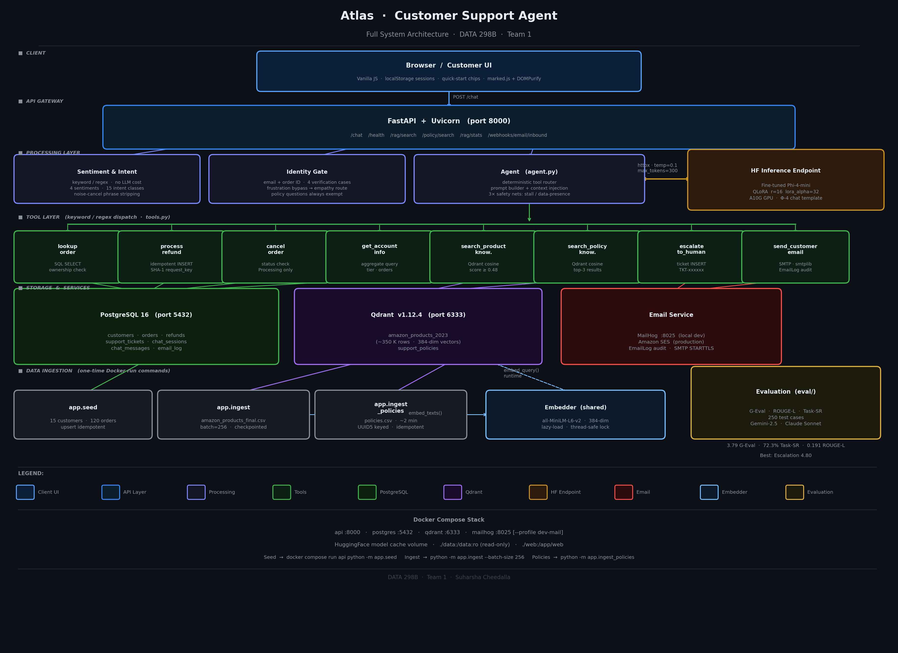

# Atlas — AI Customer Support Agent

Built for DATA 298B (SJSU Graduate Data Science, Team 1). Atlas is a production-grade customer support chatbot that combines fine-tuned small LLMs with retrieval-augmented generation, a real transactional database, and a deterministic agentic tool-calling system.

---

## What's inside

- **Fine-tuned LLMs** — four small models (Phi-4-mini, Qwen3-4B, LLaMA-3.2-3B, SmolLM3-3B) fine-tuned with QLoRA on real customer support conversation data
- **Groq API** (llama-3.3-70b-versatile) for cloud inference, with a switchable HuggingFace endpoint for the fine-tuned Phi-4-mini
- **Qdrant vector DB** — two collections: Amazon Products 2023 (~1.4M rows) + support policies; embedded with `all-MiniLM-L6-v2`
- **PostgreSQL** — real transactional DB for customers, orders, refunds, support tickets, sessions, and email logs
- **Deterministic tool routing** — keyword/regex-based, no LLM tool-call parsing; eliminates hallucinated tool calls entirely
- **8 agent tools** — order lookup, refund processing, order cancellation, account info, product RAG, policy RAG, human escalation, transactional email
- **Customer identity gate** — email/order-ID verification before any personal data is exposed
- **Sentiment tracking** — per-message sentiment detection with cumulative session drift and auto-escalation
- **Fully Dockerized** — 4 services: `api`, `postgres`, `qdrant`, `mailhog` (dev email preview)

---

## Architecture



```
Browser / UI
     │
     ▼
FastAPI (Atlas agent)
     │
     ├──► PostgreSQL  — customers, orders, refunds, tickets, sessions, email_log
     │
     ├──► Qdrant      — amazon_products_2023 (~1.4M rows) + support_policies
     │
     ├──► Groq API    — llama-3.3-70b-versatile (primary LLM)
     │    or
     │    HuggingFace — fine-tuned Phi-4-mini (switchable)
     │
     └──► SMTP / MailHog — transactional email
```

Every `/chat` request:

1. Runs keyword-based sentiment + intent detection (no extra LLM call)
2. Verifies customer identity if the query touches personal data
3. Routes tools deterministically based on keyword sets
4. Calls tools live — real SQL, real vector search, real SMTP
5. Builds LLM prompt grounded in tool results
6. Applies 5 safety nets — falls back to template response if LLM fails to ground tool data
7. Persists full turn to Postgres and responds with reply, sentiment, intent, tool calls, and RAG hits

---

## Fine-tuned models

All four models fine-tuned with QLoRA via Unsloth on Google Colab A100. Config: LoRA r=16, alpha=32, dropout=0.05, 7 target modules, 3 epochs.

| Model | Base | Eval Loss |
|-------|------|-----------|
| Phi-4-mini | `unsloth/phi-4-mini-instruct-bnb-4bit` | 0.4529 |
| Qwen3-4B | `unsloth/qwen3-4b-unsloth-bnb-4bit` | 0.3540 |
| LLaMA-3.2-3B | `unsloth/llama-3.2-3b-instruct-bnb-4bit` | 0.3379 |
| SmolLM3-3B | `unsloth/SmolLM3-3B` | **0.3220** |

Adapters on HuggingFace: [`Harshacheedalla007/ecommerce-support-phi`](https://huggingface.co/Harshacheedalla007/ecommerce-support-phi) and siblings.

---

## Agent tools

| Tool | What it does |
|------|-------------|
| `lookup_order` | Fetch a single order with ownership check |
| `search_customer_orders` | List all orders for authenticated customer |
| `process_refund` | Insert refund with $30 auto-approve threshold + SHA1 idempotency key |
| `cancel_order` | Cancel orders in `Processing` status only |
| `get_account_info` | Aggregate customer tier, join date, order history |
| `search_product_knowledge` | Qdrant cosine search over Amazon Products catalog |
| `search_policy_knowledge` | Qdrant cosine search over support policies |
| `escalate_to_human` | Open support ticket in Postgres |
| `send_customer_email` | SMTP send + audit row in `email_log` |

---

## Evaluation

Evaluated Fine-tuned+RAG vs Fine-tuned-only on 50 hand-crafted test cases across 7 categories.

| Metric | Score |
|--------|-------|
| ROUGE-L | 0.191 |
| Task Success Rate | 72.3% |
| G-Eval (Gemini 2.5 Flash, 5 dimensions) | 3.79 / 5.0 |

G-Eval dimensions: relevance, faithfulness, completeness, tone, groundedness. Best category: Escalation (4.80/5). Evaluated with `eval/evaluate.py`.

---

## Quick start

```bash
# Clone
git clone https://github.com/Ch-Suharsha/atlas.git
cd atlas

# Set up environment
cp .env.example .env
# Edit .env — set GROQ_API_KEY at minimum

# Start all services (including MailHog for local email preview)
docker compose --profile dev-mail up --build -d

# Seed demo data (run once)
docker compose run --rm api python -m app.seed

# Ingest Amazon Products catalog (~1.4M rows, idempotent + checkpointed)
docker compose run --rm api python -m app.ingest --batch-size 256

# Ingest support policies (~2 min)
docker compose run --rm api python -m app.ingest_policies
```

- Chat UI: `http://localhost:8000`
- Email preview (MailHog): `http://localhost:8025`
- Health check: `http://localhost:8000/health`

**Demo credentials:** customer ID `1`, email `demo@atlas.local`

---

## Stack

| Layer | Choice |
|-------|--------|
| API | FastAPI + uvicorn |
| LLM | Groq (llama-3.3-70b) / HuggingFace fine-tuned Phi-4-mini |
| Vector DB | Qdrant 1.12 |
| Relational DB | PostgreSQL 16 |
| Embeddings | `sentence-transformers/all-MiniLM-L6-v2` (384-dim) |
| UI | Vanilla HTML/CSS/JS |
| Email | SMTP / MailHog (dev) |
| Infra | Docker Compose |

---

## Environment variables

| Variable | Default | Purpose |
|----------|---------|---------|
| `LLM_PROVIDER` | `huggingface` | `groq` or `huggingface` |
| `GROQ_API_KEY` | — | Required if using Groq |
| `GROQ_MODEL` | `llama-3.3-70b-versatile` | Groq model name |
| `HF_ENDPOINT_URL` | — | HuggingFace inference endpoint URL |
| `DATABASE_URL` | set in compose | Postgres connection string |
| `QDRANT_URL` | `http://qdrant:6333` | Qdrant service URL |
| `SMTP_HOST` | — | SMTP host for outbound email |
| `SMTP_USERNAME` / `SMTP_PASSWORD` | — | SMTP credentials |

Full list in `.env.example`.

---

## Health

```json
GET /health
{ "status": "ok", "checks": { "postgres": "ok", "qdrant": "ok" } }
```

---

## Project structure

```
atlas/
├── backend/
│   └── app/
│       ├── agent.py          # Core agent loop, tool routing, safety nets
│       ├── tools.py          # All tool executors
│       ├── identification.py # Customer identity gate
│       ├── sentiment.py      # Sentiment + intent detection
│       ├── models.py         # SQLAlchemy models
│       ├── ingest.py         # Amazon Products → Qdrant
│       ├── ingest_policies.py
│       ├── seed.py           # Demo data
│       └── mailer.py
├── web/
│   ├── index.html
│   ├── app.js
│   └── styles.css
├── eval/
│   └── evaluate.py           # G-Eval + ROUGE-L evaluation
├── docker-compose.yml
├── Dockerfile
└── README.md
```

---

*DATA 298B — Team 1 | Suharsha Cheedalla | SJSU Spring 2026*
